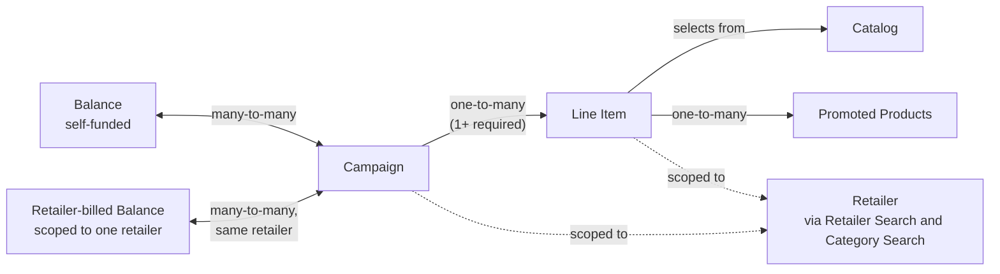

This page maps how the core campaign management entities connect, before you drill into the API reference for any one of them. If you're building a new integration, start here to understand how a Balance funds a Campaign, how a Campaign breaks down into Line Items, and where your product Catalog and a Retailer's categories fit in.

## Entity relationships

## How the entities connect

* **Campaign ↔ Balance — many-to-many.** A balance funds multiple campaigns, and a campaign can draw against multiple balances.

* **Campaign ↔ Retailer-billed Balance — many-to-many, scoped to one retailer.** Retailer-billed balances work the same way as self-funded balances, with one constraint: a retailer-billed balance only attaches to campaigns that share its `retailerId`. This doesn't limit how many campaigns it can fund — it bounds those campaigns to one retailer instead of leaving them open across an advertiser's full campaign roster. See [Balances](/retail-media/docs/balances#retailer-billed-balances) for the funding model, attributes, and endpoint changes.

* **Campaign → Line Item — one-to-many.** A campaign needs at least one line item to run ads.

* **Line Item → Catalog.** A line item selects products from the advertiser's catalog. What's synced in the catalog determines what a line item can promote.

* **Line Item → Products — one-to-many.** Promoted Products are the actual products attached to a line item, sourced from the catalog above — a child of Line Items, not a peer entity.

* **Campaign / Line Item → Retailer, via Retailer Search and Category Search.** Before creating a campaign or line item, you pick a retailer, then narrow to categories within it. This is one workflow: find a retailer, then look up its categories.

## Where to go next

| Entity | Guide |
| --- | --- |
| Balances (self-funded and retailer-billed) | [Balances](/retail-media/docs/balances) |
| Catalog | [Catalogs](/retail-media/docs/catalogs) |
| Campaigns | [Campaigns](/retail-media/docs/campaigns) |
| Line Items and Promoted Products | [Line Items](/retail-media/docs/line-items) |
| Retailer and category lookup | [Retailer Search](/retail-media/docs/retailer-search), [Category Search](/retail-media/docs/category-search) |
