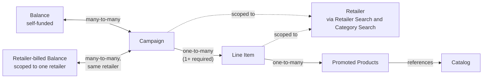

This page maps how the core campaign management entities connect, before you drill into the API reference for any one of them. If you're building a new integration, start here to understand how a Balance funds a Campaign, how a Campaign breaks down into Line Items, and where your product Catalog and a Retailer's categories fit in.

This page picks up one level below your [Account](/retail-media/docs/account) — the business and billing entity that contains everything described here. Account creation and management is handled separately; once you have one, this is what's inside it. Currently, the only campaign type supported through the API is Onsite Sponsored Products: an open auction, cost-per-click format.

## Core objects

### Balance

Funds one or more campaigns and acts as their spend cap — when linked campaigns exhaust it, they stop running, even before their scheduled end date.

* `status` — `active`, `scheduled`, or `ended`.
* `deposited`, `spent`, `remaining` — the funding amount and how much of it is left.
* `balanceType` — `capped` or `uncapped`.
* `retailerId` — set only on retailer-billed balances; `null` on self-funded ones.

### Campaign

Represents a marketing objective. The budget and attribution container that groups line items — doesn't bid or deliver on its own.

* `name`, `startDate` / `endDate` — identity and flight window.
* `status` — `active` or `inactive`; derived from line item status, not set directly.
* `budget`, `budgetSpent`, `budgetRemaining` — optional campaign-level spend cap, alongside balance-level and line-item-level budget controls.
* `drawableBalanceIds` — which balance(s) the campaign can spend from.
* `clickAttributionWindow` / `viewAttributionWindow` — how conversions get credited back to an ad.
* `monthlyPacing` / `dailyPacing` — optional pacing controls.
* `retailerId` — required and validated against the balance's `retailerId` for retailer-billed campaigns.

### Line Item

The unit that actually bids and delivers. Defines targeting, budget, and schedule for promoted products against a single retailer.

* `name`, `targetRetailerId` — identity and the one retailer this line item runs against.
* `status` — an 8-value lifecycle (`active`, `paused`, `scheduled`, `ended`, `budgetHit`, `noFunds`, `draft`, `archived`); only `active`/`paused` are writeable.
* `budget`, `budgetSpent`, `budgetRemaining` — optional line-item-level spend cap.
* `bidStrategy`, `targetBid`, `maxBid` — how the line item bids in the auction.
* `optimizationStrategy` — what the automated bid strategy optimizes toward (e.g. conversion, revenue, clicks).
* `flightSchedule` — optional day-of-week/leg-based delivery windows, on top of `startDate` / `endDate`.

### Promoted Product

Attaches one catalog product to a line item for delivery, with an optional per-product bid override.

* `id` — the catalog product ID this promoted product points at.
* `lineItemId` — the line item it's attached to.
* `bidOverride` — overrides the line item's `targetBid` for this product specifically; must clear the catalog's `minBid`.
* `status` — writeable as `active`/`paused` via the pause/unpause endpoints; more granular values are read-only and mirror line item status.

## Entity relationships

## How the entities connect

* **Campaign ↔ Balance — many-to-many.** A balance funds multiple campaigns, and a campaign can draw against multiple balances.

* **Campaign ↔ Retailer-billed Balance — many-to-many, scoped to one retailer.** A balance is either self-funded (the advertiser deposits the funds) or retailer-billed (the retailer funds it instead). Retailer-billed balances work the same way as self-funded ones for cardinality, with one constraint: a retailer-billed balance only attaches to campaigns that share its `retailerId`. This doesn't limit how many campaigns it can fund — it bounds those campaigns to one retailer instead of leaving them open across an advertiser's full campaign roster. Retailer-billed balances can't be created through the API — they're read-only, retrieved via `GET /balances` — and require API version `2026-01` or later to appear at all. See [Balances](/retail-media/docs/balances#retailer-billed-balances) for the full comparison table, attributes, and endpoint changes.

* **Campaign → Line Item — one-to-many.** A campaign needs at least one line item to run ads.

* **Line Item → Products — one-to-many.** A line item needs at least one promoted product. Promoted Products are the actual products attached to a line item — a child of Line Items in the diagram, not a peer entity.

* **Products → Catalog.** A promoted product references an entry in the advertiser's catalog — it's the product, not the line item, that points at the catalog. What's synced in the catalog determines what's available to promote.

* **Campaign / Line Item → Retailer, via Retailer Search and Category Search.** Before creating a campaign or line item, you pick a retailer, then narrow to categories within it. This is one workflow: find a retailer, then look up its categories.

* **Campaign status ← Line Item status.** Campaign status isn't set directly — it's derived: a campaign is `active` if at least one of its line items is `active`, otherwise `inactive`. See [Campaigns](/retail-media/docs/campaigns#status) and [Line Items](/retail-media/docs/line-items#lifecycle) for the full status tables.

## Two funding paths

The entities are the same either way — Balance, Campaign, Line Item — but which balance you attach determines the order you're free to do things in.

<Columns cols={2}>
  <Card title="Self-funded">
    1. Pick a retailer whenever it suits you — before or after creating the campaign.
    2. Attach any self-funded balance; it isn't retailer-scoped.
    3. Mix line items for different retailers within the same campaign.
  </Card>

  <Card title="Retailer-billed">
    1. The retailer is already decided: it's fixed on the balance (`retailerId`), which you can only retrieve via `GET /balances`, not create.
    2. Every campaign drawing on that balance must set the matching `retailerId` at creation.
    3. Every line item under that campaign must target that same retailer — no mixing.
  </Card>
</Columns>

Get the funding model wrong for your workflow and you'll hit `RetailerMismatchWithBalance` at campaign creation. See [Balances](/retail-media/docs/balances#retailer-billed-balances) for the full comparison and error codes.

## Where to go next

| Entity | Guide |
| --- | --- |
| Balances | [Balances](/retail-media/docs/balances) |
| Catalog | [Catalogs](/retail-media/docs/catalogs) |
| Campaigns | [Campaigns](/retail-media/docs/campaigns) |
| Line Items and Promoted Products | [Line Items](/retail-media/docs/line-items) |
| Retailer and category lookup | [Retailer Search](/retail-media/docs/retailer-search), [Category Search](/retail-media/docs/category-search) |
